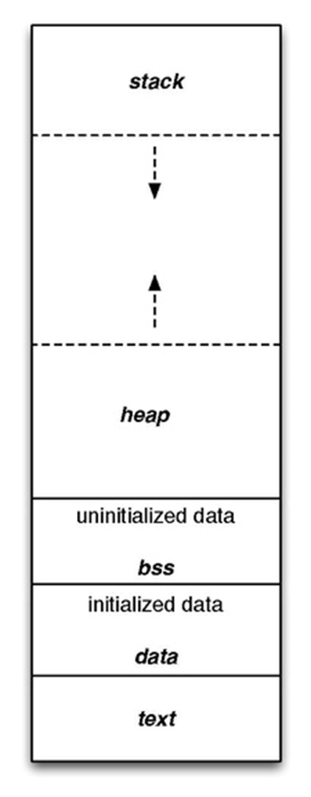

<Summary>
	<h1>Embedded System - Basic Knowledge<h1>
</summary>

<h2>Lập trình nhúng là gì?</h2>
Lập trình nhúng là việc lập trình các hệ thống nhúng, là các hệ	thống điện tử được thiết kế để thực hiện một nhiệm vụ cụ thể. Các hệ thống nhúng thường được sử dụng trong các thiết bị điện tử tiêu dùng, thiết bị công nghiệp, thiết bị tự động hóa, v.v.

<h2>Kiến thức cơ bản về lập trình nhúng bao gồm hai phần chính:</h2>

<h3> 1. Lập trình phần mền nhúng: là phần quan trong nhất.</h3>
- Kiến thức về ngôn ngữ lập trình cần phải nắm vững: C, C++, Java.
- Kiến thức về cấu trúc dữ liệu và giải thuật là nền tảng xây dựng ứng dụng nhúng hiệu quả
- Kiến thức về hệ điều hành: Hệ điều hành cung cấp môi trường để chạy các ứng dụng nhúng. 
- Kiến thức về thiết kế và triển khai ứng dụng nhúng (Thiết kế, triển khai, kiểm tra và bảo trì các ứng dụng).

<h3> 2. Lập trình phần cứng nhúng.</h3>
- Kiến thức cơ bản về điện tử: các linh kiện & công dụng của chúng
- Kiến thức về mạch điện tử: Cách thiết kế tạo ra các mạch điện kết nối các linh kiện với nhau.
- Kiến thức về PCB: Thiết kế PCB theo sơ đồ nguyên lý và quá trình tạo ra mạch in PCB.
- Kiến thức về hardware debug: sử dụng các thiết bị đo để kiểm tra lỗi của mạch in. 

<h2>Dưới đây là các bước đầu để bắt đầu trở thành lập trình viên nhúng</h2>

<details>
	<summary>
  		<h2>Chapter 1. C programming language</h2>
	</summary>
    
<details>
	<summary>
		<h3>Lesson 1. Macro - Function - Inline function </h3>
	</summary>

<h4>Macro là:</h4>
Là một công cụ của bộ tiền xử lý (preprocessor) cho phép định nghĩa các đoạn mã (code) có thể được thay thế bằng văn bản khác tại thời điểm biên dịch. Macro có thể được sử dụng để:
- Tạo các đoạn mã lập đi lập lại.
- Thực hiện các phép toán đơn giản.
- Điều khiển quá trình biên dịch.

Cú pháp định nghĩa macro: 
<h4>Lưu ý:</h4>
Tên của macro phải là IN HOA toàn bộ, đây là qui luật để hạn chế "Macro đẻ ra bug" vì nếu đặt tên thường có phần tỉ lệ trùng với một biết này đó trong chương trình dẫn đến lỗi, do compiler không thể phát hiên ra lỗi này.


```C 
// Cú pháp: #define  (Object_name)  (<)Object_value)
// Tạo ra hằng số (đối tượng) MAX = 3000
#define MAX 3000 

// Macro tiền xử lý CREATE_FUNC: tạo ra định nghĩa hàm.
// Macro này có 2 đối số: Func_name và cmd (Func_name là tên hàm, cmd là lệnh được thực thi khi gọi hàm)
// Macro CREATE_FUNC hoạt động bằng cách mở rộng định nghĩa macro thành 1 định nghĩa hàm
#define CREATE_FUNC(Func_name, cmd)
void Func_name()
{
	printf("print command\n");
}
```


Macro có 2 loại chính: 
1. Macro giống như đối tượng (object-like macro): Macro này giống như 1 hằng số. Có thể được sử dụng để thay thế cho một giá trị cụ thể.
Ví dụ:

```C
#define PI 3.14159
int main()
{
	printf("Gia tri cua Pi la: %f\n",PI);
	return;
}
```
2. 	Macro giống như hàm(function-like macro): Macro này giống như một hàm, có thể nhận tham số và trả về giá trị.

```C
#define max(x,y) ((x) > (y) ? (x) (y)); 
int main()
{
	int a = 10;
	int b = 20;
	printf("Gia tri cua nay: %d\n", max(x,y));
	return 0;
}
```
Việc sử dụng macro có thể làm cho C/C++ trở nên gắn gọn, các macro được thực hiện ở quá trình tiền xử lí.

<h4>Function là: </h4>    

- Function là Hàm dùng để làm một chức năng nào đó cụ thể.
- Giúp chia nhỏ các các chương trình lớn thành những chương trình nhỏ(function).
- Và có thể tại sử dụng nhiều lần trong chương trình.


<h4> Các điểm giống và khác của MACRO VÀ FUNCTION </h4>

Giống nhau:
- Ở mục đích : viết mã ngắn gọn và dễ hiểu hơn
- Cả 2 đều có thể tái sử dụng

Khác nhau:

Đặc điểm | Macro  | Function
------------- | ------------- | -------------
Cách định nghĩa | Macro được định nghĩa bằng chỉ thị tiền xử lý (preprocessor directives)  | Function được định nghĩa bằng cú pháp (function declaration)
Cách sử dụng | Macro được sử dụng bằng các thay thế macro name bằng nội dung của macro | Function được sử dụng bằng cách gọi tên function với các tham số cần thiết
Thời gian thực thi | Macro được thay thế bởi preprocessor trước khi chương trình được biên dịch | Function được gọi trong thời gian thục thi chương trình
Kích thước mã |Macro có thể làm tăng kích thước mã thực thi do nội dung của macro được sao chép nhiều lần | Function chỉ được sao chép 1 lần trong bộ nhớ khi chương trình được biên dịch
Tính linh hoạt | Macro có thể được sử dụng để thay thế bất kì đoạn mã nào | Function có thể được sử dụng để thực thi một tác vụ cụ thể 

Ưu điểm của Macro:
- Macro có thể được sử dụng để thay thế các đoạn mã dài và phức tạp bằng một đoạn mã ngắn và đễ hiểu hơn
- Macro có thể được sử dụng để tạo ra các định nghĩa hằng và biến
- Macro có thể được sử dụng để thức hiện các phép toàn đơn giản (giúp dễ đọc hiểu)

Nhược điểm của macro:
- Làm tăng kích thước chương trình
- Có thể làm chậm thời gian chạy chương trình
- Có thể làm khó khăn cho việc gỡ lỗi 

Ưu điểm của function:
- Có thể chia nhỏ chương trình thành các module nhỏ
- Có thể được tái sử dụng mã 
- Giúp dễ được chương trình hơn, dễ hiểu và dễ bảo trì
Nhược điểm của function:
- Có thể làm tăng độ phức tạp của chương trình
- Có thề làm chậm thời gian chạy chương trình

Vậy lực chọn như thế nào với macro và function:
- Độ phức tạp của mã cần thay thế: Nếu mã này là ngắn và đơn giản thì dùng ```macro```
- Tần suất sử dụng đoạn mã cần thay thế: Nếu được sử dụng đi, sử dụng lại nhiều lần thì dùng ```function```
- Kích thước và tốc độ của chương trình: Nếu chương trình cần tối ưu về kích thước và tốc độ thì nên tránh dùng ```macro```

Nhìn chung, function là một lựa chọn tốt hơn macro trong hầu hết các trường hợp. Tuy nhiên, macro có thể được sử dụng hiệu quả trong một số trường hợp cụ thể.


Vì biên dịch trước trong mã nguồn nên *Macro* tối ưu về tốc độ nhưng "có thể" làm tăng kích thước chương trình | Vì được lưu cố định trong 1 vùng nhớ nên *Function* tối ưu về kích thước chương trình nếu được gọi nhiều lần nhưng "có thể" không tối ưu tốc độ xử lý

Ví dụ: Tính tổng  2 số 
Macro: 
```C 
#define SUM(x, y) ((x) + (y))
```

Function: 
```C 
int sum(int x, int y) {
    return x + y;
}
```
Cả hai cách trên đều có thể được sử dụng để tính tổng của hai số, tuy nhiên, sử dụng function sẽ cho phép bạn định nghĩa các loại tham số và ki

<h4>Inline Function</h4>

Inline function là một loại hàm thường gặp trong lập trình C++ và trong lập trình Embedded.
Từ khóa ```inline``` được dùng để đề nghị (không phải là bắt buộc) trình biên dịch (compiler) thực hiện triển khai nội tuyến (inline expansion) với hàm đó, hay nói cách dễ hiểu là chèn code của hàm đó tại địa chỉ mà nó được gọi.

Mục đích của ```inline function``` là để tăng hiệu suất của chương trình. Khi một hàm được khai triển nội tuyến, thì toàn bộ mã của hàm đó sẽ được chèn và vị trí mà hàm đó được gọi. Điều này sẽ loại bỏ thời gian cần thiết để gọi hàm, vì toàn bộ mã của hàm dẽ được sẵn sàng ở đó.

```inline function``` thường được dùng cho các hàm đơn giản, kích thước nhỏ và được gọi thường xuyên. 

Ví dụ: hàm sau đây là một inline function điển hình.
```C
inline int add(int a, int b){ 
	return a+b;
}
```
Hàm này rấy là đơn giản, và nó được gọi thường xuyên. Khai triển nội tuyến hàm này sẽ tăng hiệu suất chương trình.

Tuy nhiên, ```inline function``` cũng có các nhược điểm. 
- Có thể làm tăng kích thước chương trình, vì mã của hàm sẽ được chèn vào nhiều vị trí khác nhau.
- Có thể làm giảm tích linh hoạt của chương trình, vì mã hàm không còn có thể được sử dụng lại trong ngữ cảnh khác.

Mẹo để làm việc với inline function:
- Chỉ dùng cho các hàm nhỏ, đơn giản và được gọi nhiều lần
- Cẩn thận kiểm tra hiệu suất của chương trình trước và sau khi sử dụng inline function
- cân nhắc sử dụng macro thay vì inline function nếu cần phải sử dụng lại mã của hàm trong ngữ cảnh khác.

Ví dụ này viết bằng CPP, những cũng có thể hiểu được tính chất inline function

```C++
#include <iostream>
using namespace std;
inline int add(int a, int b){
	return a+b;
}
int main()
{
	int x = 10;
	int y = 20;
	cout << "x + y = " << add(x,y)<< endl;
	return 0;
}
```

</details>


<details>
<summary>BUỔI 3: STRUCT UNION  </summary> 

- Struct và Union là 2 cấu trúc dữ liệu do lập trình viên định nghĩa bao gồm các biến với kiểu dữ liệu khác nhau. <br/>
- Việc định nghĩa, khai báo biến, truy cập đến các thành phần của struct và union là giống nhau. Tuy nhiên, giữa struct và union có một vài điểm khác nhau sau:

Struct  | Union
------------- | -------------
Size của struct ít nhất bằng tổng size của các thành phần của struct. Sử dụng từ “ít nhất” là vì size struct còn phụ thuộc vào alignment struct. sizeof(A) = 16 (vì sizeof của uint64_t, uint32_t, uint8_t lần lượt là 8, 4, 1 byte nên 1 + 4 là 5 byte nên phải chèn thêm 3 byte bộ nhớ đệm và cho ra lần quét tiếp là 8 byte) ``` struct { uint8_t var1; uint32_t var2; uint64_t var3; } ``` | Size của union bằng size của thành phần có size lớn nhất trong union. sizeof(A) = 8 (kích thước của thành phần lớn nhất trong union là uint64_t là 8 byte) ``` union { uint8_t var1; uint32_t var2; uint64_t var3; } ```
Tại cùng 1 thời điểm run-time, có thể truy cập vào tất cả các thành phần của struct | Tại cùng 1 thời điểm run-time, chỉ có thể truy cập 1 thành phần của union
</details>

<details>
<summary>BUỔI 4: COMPILER - TRÌNH BIÊN DỊCH</summary>      
  
Compiler hay còn gọi là trình biên dịch có thể được hiểu là công việc dịch chuỗi câu lệnh được viết từ một ngôn ngữ lập trình thành chương trình tương đương dưới dạng ngôn ngữ máy tính, thường là ngôn ngữ ở cấp thấp hơn, ngôn ngữ máy. Đơn giản dễ hiểu thì có thể tạm nói là nhờ Complier này mà file .c chúng ta viết mới được dịch thành file .hex .bin để nạp được xuống một MCU bất kỳ.
Quá trình biên dịch.

# 1. Pre-processing (Tiền xử lí)
Bộ tiền xử lý C không phải là một phần của trình biên dịch, mà là một bước riêng biệt trong quá trình biên dịch. Nói một cách đơn giản, Bộ tiền xử lý C chỉ là một công cụ thay thế văn bản và nó hướng dẫn trình biên dịch thực hiện tiền xử lý cần thiết trước khi biên dịch thực tế. Các lệnh tiền xử lí bắt đầu bằng kí tự "#" 
Ví dụ: 
- " #define" :Thay thế các macro
- "#include" :Chèn thêm file khác như các thư viên
Dùng GCC bằng lệnh sau để có file tiền xử lí: gcc -E main.o -o main.i (chuyển từ file .c sang file .i)
# 2. Compiling (Giai đoạn dịch NNBC sang ngôn ngữ Assembly)
Chuyển chúng sang dạng mã Assembly là một ngôn ngữ bậc thấp (hợp ngữ) gần với tập lệnh của bộ vi xử lý.
Quá trình này sẽ biên dịch từ code `.i` sang ngôn ngữ assembly `.s`.
Dùng lệnh `gcc -S -o filename.s filename.c` để có thể xem code sau quá tình compiler.
# 3. Assembling (Hợp ngữ)
Dich chương trình => Sang mã máy 0 và 1
Một tệp mã máy (.obj) sinh ra trong hệ thống sau đó
# 4. Linking (Liên kết)
Trong giai đoạn này mã máy của một chương trình dịch từ nhiều nguồn (file .c hoặc file thư viện .lib) được liên kết lại với nhau để tạo thành chương trình đích duy nhất Mã máy của các hàm thư viện gọi trong chương trình cũng được đưa vào chương trình cuối trong giai đoạn này. Chính vì vậy mà các lỗi liên quan đến việc gọi hàm hay sử dụng biến tổng thể mà không tồn tại sẽ bị phát hiện. Kể cả lỗi viết chương trình chính không có hàm main() cũng được phát hiện trong liên kết.
</details>


<details>
<summary>BUỔI 5: POINTER - CON TRỎ</summary>      
POINTER: Là một biến đặc biệt, dùng để lưu địa chỉ của biến chứ không phải giá trị, được lưu trên ram. Kích thước của biến pointer phụ thuộc vào vi xử lý.

# Normal pointer 
Là con trỏ dùng để lưu địa chỉ của biến đó, kiểu dữ liệu của con biến như thế nào thì kiểu con trỏ cũng vậy.

Ví dụ:

int a = 10 // giả sử có địa chỉ là 0x01
int *ptr = &a = 0x01 // * ptr ở đây là biến con trỏ ptr, do quy tắc đặt tên biến pointer phải có dấu * ở trước.
printf("Dia chi: %p,ptr); // Dia chi 0x01.
printf("Gia tri: %d, *ptr);// * ptr là giá trị của con trỏ ptr trỏ đến.

# Void Pointer
Con trỏ void có thể trỏ đến các vùng nhớ có các kiểu dữ liệu khác nhau.
Con trỏ void không xác định được kiểu dữ liệu của vùng nhớ mà nó trỏ tới, vì vậy không thể truy cập xuất trực tiếp nội dung thông qua toán tử derefernce () được. Mà con trỏ kiểu void cần phải được ép kiểu một cách rõ ràng sang con trỏ có kiểu dữ liệu khác trước khi sử dụng toán tử derefernce ().
```
#include <stdio.h>

void tong(int a,int b){
   printf("tong %d va %d = %d\n", a, b, a + b);
}

int main()
{

   int i = 3;
   double d =12.4;
   char c ='B';

   // con trỏ void có thể trỏ đến bất kỳ địa chỉ nào 
   void *ptr = &i;

   // để lấy giá trị từ con trỏ void ta cần ép kiểu nó
   printf("i = %d\n",*(int *)ptr);

   ptr = &d;
   printf("d = %f\n",*(double *)ptr);

   ptr = &c;
   printf("c = %c\n",*(char *)ptr);

   ptr = &tong;
   ((void (*)(int, int))ptr)(9,1);
   return 0;
}
```
# Null Pointer
Con trỏ null là con trỏ có giá trị và địa chỉ bằng 0.
Khi khai báo 1 con trỏ:
Phải khai báo địa chỉ cho nó.
Nếu mà chưa sử dụng thì gán cho nó con trỏ null.
Hoặc khi khai báo con trỏ và đã sử dụng nó rồi, khi không muốn sử dụng nó nữa thì phải gán nó lại là con trỏ null.
```
    int *ptr = NULL;
```
</details>


<details>
<summary>Lesson 5: PHÂN VÙNG NHỚ</summary>

Đây là phân vùng nhớ của một chương trình C/C++ 



 
• Text : <br/>
– Quyền truy cập chỉ Read và nó chưa lệnh để thực thi nên tránh sửa đổi instruction. <br/>
– Chứa khai báo hằng số trong chương trình (.rodata) <br/>
• Data: <br/>
– Quyền truy cập là read-write. <br/>
– Chứa biến toàn cục or biến static với giá trị khởi tạo khác không. <br/>
– Được giải phóng khi kết thúc chương trình. <br/>
• Bss: <br/>
– Quyền truy cập là read-write. <br/>
– Chứa biến toàn cục or biến static với giá trị khởi tạo bằng không or không khởi tạo. <br/>
– Được giải phóng khi kết thúc chương trình. <br/>
• Stack: <br/>
– Quyền truy cập là read-write. <br/>
– Được sử dụng cấp phát cho biến local, input parameter của hàm,… <br/>
– Sẽ được giải phóng khi ra khỏi block code/hàm <br/>
• Heap: <br/>
– Quyền truy cập là read-write. <br/>
– Được sử dụng để cấp phát bộ nhớ động như: Malloc, Calloc, … <br/>
– Sẽ được giải phóng khi gọi hàm free,… <br/>

***So sánh Stack và Heap**: 
- Giống nhau: Bộ nhớ Heap và bộ nhớ Stack bản chất đều cùng là vùng nhớ được tạo ra và lưu trữ trong RAM khi chương trình được thực thi.
- Khác nhau:

Stack  | Heap
------------- | -------------
Được dùng để lưu trữ các biến cục bộ trong hàm, tham số truyền vào...Truy cập vào bộ nhớ này rất nhanh và được thực thi khi chương trình được biên dịch. |  Được dùng để lưu trữ vùng nhớ cho những biến con trỏ được cấp phát động bởi các hàm malloc - calloc - realloc (trong C).
Kích thước của bộ nhớ Stack là cố định, tùy thuộc vào từng hệ điều hành, ví dụ hệ điều hành Windows là 1 MB, hệ điều hành Linux là 8 MB (lưu ý là con số có thể khác tùy thuộc vào kiến trúc hệ điều hành của bạn).  | Kích thước của bộ nhớ Heap là không cố định, có thể tăng giảm do đó đáp ứng được nhu cầu lưu trữ dữ liệu của chương trình.
Vùng nhớ Stack được quản lý bởi hệ điều hành, dữ liệu được lưu trong Stack sẽ tự động hủy khi hàm thực hiện xong công việc của mình.  | Vùng nhớ Heap được quản lý bởi lập trình viên (trong C hoặc C++), dữ liệu trong Heap sẽ không bị hủy khi hàm thực hiện xong, điều đó có nghĩa bạn phải tự tay hủy vùng nhớ bằng câu lệnh free (trong C), và delete hoặc delete [] (trong C++), nếu không sẽ xảy ra hiện tượng rò rỉ bộ nhớ.

***Một số lưu ý**:
- Việc tự động dọn vùng nhớ còn tùy thuộc vào trình biên dịch trung gian.
- Vấn đề lỗi xảy ra đối với vùng nhớ: 
    - Stack: bởi vì bộ nhớ Stack cố định nên nếu chương trình bạn sử dụng quá nhiều bộ nhớ vượt quá khả năng lưu trữ của Stack chắc chắn sẽ xảy ra tình trạng tràn bộ nhớ Stack (Stack overflow), các trường hợp xảy ra như bạn khởi tạo quá nhiều biến cục bộ, hàm đệ quy vô hạn,... Ví dụ về tràn bộ nhớ Stack với hàm đệ quy vô hạn:
        ```
        int foo(int x){
            printf("De quy khong gioi han\n");
            return foo(x);
        }
        ```
    - Heap: Nếu bạn liên tục cấp phát vùng nhớ mà không giải phóng thì sẽ bị lỗi tràn vùng nhớ Heap (Heap overflow). Nếu bạn khởi tạo một vùng nhớ quá lớn mà vùng nhớ Heap không thể lưu trữ một lần được sẽ bị lỗi khởi tạo vùng nhớ Heap thất bại. Ví dụ trường hợp khởi tạo vùng nhớ Heap quá lớn:
        ```
        int *A = (int *)malloc(18446744073709551615);
        ```

</details>

<details>
<summary>BUỔI 7: VARIABLE - BIẾN</summary>

# Static Variable - Extern Variable
Là biến CHỈ ĐƯỢC KHỞI TẠO 1 LẦN DUY NHẤT khi gọi hàm lần đầu tiên (Nếu được khởi tại lại nó sẽ bỏ qua dòng lệnh đó) và nó sẽ tiếp tục tồn tại trong suốt vòng đời của chương trình.
Ví dụ: Biến static cục bộ
  
        
        void Count()
        {
        static int temp = 0;
        printf("Temp = %d",temp);
        temp++
        }
        
Ví dụ: biến toàn cục
File test.c có hàm sau: 
        ```
        void display(){
          printf('TEST')
        }
        ```
File main.c như sau:

        
        extern display();
        
        int main(){
          display();
          return 0;
        }
        
# Từ khóa volatile
Trong lập trình nhúng rất thường hay gặp khai báo biến với từ khóa volatile. Việc khai báo biến volatile là rất cần thiết để tránh những lỗi sai khó phát hiện do tính năng optimization của compiler.
- Volatile có nhiệm vụ báo cho Compiler không được tối ưu biến đó.
- Biến này dùng cho các biến mà giá trị của nó có thể thay đổi hoặc có nhiều task RTOS dùng chung 1 biến.
Ví dụ:

        volatile int x = readADC();
  

</details>
</details>


    
<details>
  <summary><h2>C++ programming language</h2></summary>

<details> 
<summary> Class </summary>
    
# Class là gì?  
- Class là một kiểu dữ liệu do người dùng định nghĩa, chứa các dữ liệu và các hàm của riêng nó. Class là một thành phần chính của lập trình hướng đối tượng (OOP).    
- Class định nghĩa các thuộc tính "data members" còn gọi là property và phương thức "member functions" còn gọi là method mà các đối tượng của nó có thể sử dụng.
-  từ khóa class sẽ chỉ điểm bắt đầu của một class sẽ được cài đặt. Class trong C++ giúp tổ chức mã nguồn một cách có cấu trúc và tái sử dụng, đồng thời cho phép ẩn thông tin và triển khai tính kế thừa, đa hình và đóng gói.
# Phạm vi truy cập (Access modifiers):

Access modifier là phạm vi truy cập của các thuộc tính và phương thức sẽ được khai báo bên dưới nó. Có 3 phạm vi truy cập trong C++ là public, private và protecte.

- Public: Các member được khai báo trong Public thì các Object có thể truy cập trực tiếp tới được. Và các User có thể sử dụng và thay đổi các giá trị trong các member này.
    
- Private: Được sử dụng khi bạn muốn chặn User truy cập vào những member khai báo trong phạm vi này, giới hạn truy cập và sửa đổi giá trị của chúng. Sử dụng các member trong Public để truy cập đến các member trong Private.
    
- Protected: Tương tự như Private, nhưng Private thì các class con không thể kết thừa được các member trong Private của class chính, còn Protected thì lại cho phép các class con có thể kế thừa được các member trong protected của class chính.
    
# Constructor
Constructor hay hàm dựng là một hàm đặc biệt.
Constructor là một hàm sẽ có tên trùng với tên của class.
Sẽ được gọi chạy đầu tiên ngay khi chúng ta khởi tạo một object.
```
class SinhVien{
	public: 
		SinhVien(int tuoi, int lop); //có tên trùng với tên của class gọi là contructor
		void hienThi(); //method	
	private: 
		int tuoi; //property
		int lop; //property
};
void SinhVien::hienThi(){
	cout<<"Tuoi: "<<tuoi<<endl;  
	cout<<"Lop "<<lop<<endl;
}
SinhVien::SinhVien(int tuoi,int lop){
	SinhVien::tuoi = tuoi; //class SinhVien có thể truy cập đến tất cả nhưng member nằm trong nó
	SinhVien::lop = lop;
}
int main(){
	// khi có contructor thì nó luôn luôn chạy đầu tiên khi object được khởi tạo.
	// contructor có thể có tham số đầu vào hoặc không có
	SinhVien sv(17,6); //có thể gán giá trị trực tiếp vào khai báo ở public
	sv.hienThi();
	return 0;
}
``` 
# Biến static trong class
Khi định nghĩa static trong class thì phải khởi tạo lần đầu ở ngoài.
Khi khởi tạo thì địa chỉ của nó tồn tại trong suốt chương trình nên member static này của các object sẽ đều có cùng 1 địa chỉ.
```c++
class SinhVien{
	public:
		string ten;
		static int tuoi; //khi khai báo static trong class thì phải hởi tạo lần đầu ở ngoài
};

int SinhVien::tuoi; //ta có thể gán giá trị cho nó, khi khởi tạo thì địa chỉ của nó tồn tại trong suốt chương trình nên member static này của các object sẽ có cùng 1 địa chỉ.

int main(){
	
	SinhVien sv1,sv2;
	//về địa chỉ của hai object thì giống với struct. sv1 và sv2 sẽ được cấp vùng nhớ khác  với kích thước là tổng kích thước của các member và bộ nhớ đệm, địa chỉ của nó sẽ là địa chỉ của member đầu tiên, và các member sẽ mang đỉa chỉ khác nhau như trong struct.
	return 0;
}
```
# Các đặc tính của OOP
- Có 4 đặc tính: Tính đa hình, tính kế thừa, tính trừu tượng, tính đóng gói.
  
	- ***Inheritance (Tính kế thừa ):*** Một **class** có thể kế thừa các thuộc tính của một **class** khác đã tồn tại trước đó. Trong C++, khi một **class** con được tạo ra bởi việc kế thừa thuộc tính của **class** cha thì ta gọi class con đó là **subclass** và class cha là **superclass**. Chỉ có **Public** và **Protected** mới được kế thừa còn **Private** thì không được kế thừa, muốn kế thừa được các **member** trong **Private** buộc phải đổi lại **Protected**.
		```c++
  		class DoiTuong{
			public:
				void setThongTin(string ten, int tuoi);
				void hienThi();
			protected:
				int TUOI; //property
				string TEN;
		};
		
		void DoiTuong::hienThi(){
			cout<<"Day la class DoiTuong"<<endl;
			cout<<"Ten: "<<TEN<<endl;  
			cout<<"Tuoi "<<TUOI<<endl;
		}
		
		void DoiTuong::setThongTin(string ten,int tuoi){
			TEN = ten;
			TUOI = tuoi;
		}
  		class SinhVien : public DoiTuong{
			public:
				void setThongTin(string ten, int tuoi, int mssv);
				void hienThi(); //method	
			private:
				int MSSV;
		};
		
		void SinhVien::setThongTin(string ten, int tuoi, int mssv){
			TEN = ten;
			TUOI = tuoi;
			MSSV = mssv;
		}
		
		void SinhVien::hienThi(){
			cout<<"Day la class DoiTuong"<<endl;
			cout<<"Ten: "<<TEN<<endl;  
			cout<<"Tuoi "<<TUOI<<endl;
			cout<<"Mssv "<<MSSV<<endl;
		}
		
		int main(){
			SinhVien dt;
			dt.setThongTin("Hoang", 17);
			dt.hienThi();
			
			SinhVien sv;
			sv.setThongTin("Toan", 15,100);
			sv.hienThi();
			
			return 0;
		}
  		```
	- ***Abstraction (Tính trừu tượng):*** Là một khả năng mà chương trình có thể bỏ qua sự phức tạp bằng cách tập trung vào cốt lõi của thông tin cần xử lý. Điều đó có nghĩa, bạn có thể xử lý một đối tượng bằng cách gọi tên một phương thức và thu về kết quả xử lý, mà không cần biết làm cách nào đối tượng đó được các thao tác trong class. (Là chỉ những thứ cần thiết mà người dùng cần sử dụng thì được nằm ở public còn tính toán phức tạp mà người dùng không quan tâm đến thì nằm ở private)
		- Ví dụ: Người dùng nhập a,b,c và muốn biết phương trình có nghiệm hay vô nghiệm. thì những phần method nhập và xuất thì nằm ở public, còn method tính toán kiểm tra thì nằm ở private,những phần nằm ở private người dùng không được quyền can thiệp vào.
  	- ***Polymorphism (Tính đa hình):*** Là một khả năng mà một phương thức trong class có thể đưa ra các kết quả hoàn toàn khác nhau, tùy thuộc vào dữ liệu được xử lý.
  	  	- Ta có thể khai báo tên hàm các method giống nhau nhưng phải khác đầu vào, bởi vì khi tên trùng nhau thì nó dựa vào inputparameter để xác định đó hàm nào.
  	  	- Ví dụ:
  	  	```c++
  	  	class th{
			public:
				void tong(int a, int b);
				void tong(int a, double b);
				void tong(int a, int b, int c);
		};
  		```
	- ***Encapsulation (Tính đóng gói):*** Có ý nghĩa không cho phép người sử dụng các đối tượng thay đổi trạng thái nội tại của một đối tượng, mà chỉ có phương thức nội tại của đối tượng có thể thay đổi chính nó. Điều đó có nghĩa, dữ liệu và thông tin sẽ được đóng gói lại, giúp các tác động bên ngoài một đối tượng không thể làm thay đổi đối tượng đó, nên sẽ đảm bảo tính toàn vẹn của đối tượng, cũng như giúp giấu đi các dữ liệu thông tin cần được che giấu.
   		- Ví dụ: những biến nhập vào như a,b,c và biến xuất ra kết quả x1,x2 thì không được khai báo ở public, phải nằm ở trong private, và những biến đó được nhập và xuất thông qua các method, để tránh người dùng sửa đổi code làm lỗi chương trình. ví dụ để các biến đó ở public, người dùng nhập a,b,c ở method nhập, sau đó người dùng còn có thể chỉnh sửa a,b,c,delta... lúc này chương trình dễ bị trả kết quả sai.

</details>

<details>
  <summary>Namespace</summary>

- Namespace là từ khóa trong C++ được sử dụng để định nghĩa một phạm vi nhằm mục đích phân biệt các hàm, lớp, biến, ... cùng tên trong các thư viện khác nhau. 
- Khi tạo `namespace` nếu muốn dùng chung tên biến của các `member` thì khi khai báo tên của `namespace` thì phải khai báo tên khác nhau
- Nếu dùng chung tên của namespace thì tên của các meber phải khác nhau (dù có chung file hay khác file), Do khai báo cùng tên namespace thì dùng chung bộ nhớ nên nếu tên các member cũng giống thì những member giống nhau sẽ cùng chung 1 địa thì sẽ dẫn đến xung đột vùng nhớ
- ví dụ:
	```C++
	namespace A{
		int a;
		void function(){...}
		struct c{...};
	};
	namespace B{
		int a;
		void function(){...}
		struct c{...};
	}
	```
 
</details>

<details>
  <summary>Template</summary>
	
- **Template (khuôn mẫu)** là một từ khóa trong C++, và là một kiểu dữ liệu trừu tượng tổng quát hóa cho các kiểu dữ liệu int, float, double, bool...
- **Template** trong C++ có 2 loại đó là function template & class template.
- **Template** giúp người lập trình định nghĩa tổng quát cho hàm và lớp thay vì phải nạp chồng (overloading) cho từng hàm hay phương thức với những kiểu dữ liệu khác nhau.
- Ví dụ:
	- Những hàm có form giống nhau chỉ khác kiểu dữ liệu.
	```c++
	int tong(int a, int b);
	double tong(double a, double b);
	template<typename var> //thay vì ta code hai hàm riêng để xử lý, thì ta có thể code dùng template chung lại để gọn code hơn.
	int tong(var a, var b){
		return (var)(a+b);
	}
	```
	- Nếu a và b khác kiểu dữ liệu thì tên var của hai thằng phải khác nhau. Ví dụ var a, var1 b. Lúc này var đại diện cho kiểu dữ liệu a và var1 đại diện cho kiểu dữ liệu b.
	
</details>
<details>
  <summary>Vector, List & Map</summary>

### Vector là gì?
- Vector là một cấu trúc dữ liệu trong C++ dùng để chứa các đối tượng khác. Tương tự như mảng (array), vector cũng có thể chứa nhiều phần tử.
- Các phần tử trong vector được lưu trữ một cách liên tiếp trong bộ nhớ. Điều này cho phép truy cập dễ dàng đến các phần tử bằng cách sử dụng chỉ số (index).
- vector khác mảng thông thường là kích thước của vector có thể thay đổi trong quá trình thực thi chương trình. Khi cần, vector có thể mở rộng (tăng kích thước) hoặc thu hẹp (giảm kích thước) để chứa thêm hoặc loại bỏ các phần tử.
- Sử dụng thư viện `#include<vector>`.
- Modifiers:
Modifiers
	- ***push_back():*** Hàm đẩy một phần tử vào vị trí sau cùng của vector. Nếu kiểu của đối tượng được truyền dưới dạng tham số trong push_back() không giống với kiểu của vector thì sẽ bị ném ra. VD: ten-vector.push_back(ten-cua-phan-tu);
	- ***assign():*** Nó gán một giá trị mới cho các phần tử vector bằng cách thay thế các giá trị cũ. VD: ten-vector.assign(int size, int value);
	- ***pop_back():*** Hàm pop_back () được sử dụng để xóa đi phần tử cuối cùng một vector.
	- ***insert():*** Hàm này chèn các phần tử mới vào trước phần tử trước vị trí được trỏ bởi vòng lặp. Chúng ta cũng có thể chuyển một số đối số thứ ba, đếm số lần phần tử được chèn vào trước vị trí được trỏ.
   	- ***erase():*** Hàm được sử dụng để xóa các phần tử tùy theo vị trí vùng chứa
	- ***emplace():*** Nó mở rộng vùng chứa bằng cách chèn phần tử mới vào
	- ***emplace_back():*** Nó được sử dụng để chèn một phần tử mới vào vùng chứa vector, phần tử mới sẽ được thêm vào cuối vector
	- ***swap():*** Hàm được sử dụng để hoán đổi nội dung của một vector này với một vector khác cùng kiểu. Kích thước có thể khác nhau.
	- ***clear():*** Hàm được sử dụng để loại bỏ tất cả các phần tử của vùng chứa vector.
- Ví dụ:
	```c++
	//dùng thư viện vector giống cấp phát bộ nhớ động trong c, nhưng có thư viện hỗ trợ các công cụ nhanh hơn.
	#include <vector>
	
	vector<int> array;	// khai báo mảng kiểu int
	array.push_back(4);  //thêm phần tử tại 0 là 4
	array.push_back(8);  //thêm phần tử tại 1 là 8
	array.push_back(20);
	array.push_back(15); //thêm phần tử tại 4 là 15
	
	//từ C++ 11 trở đi có for cải :
	for(int item : array){ // có thể dùng biến auto item, biến auto sẽ tự định nghĩa item thuộc kiểu dữ liệu gì tùy vào giá trị và nó được lưu
		printf("i = %d\n",item);
	}
	
	array.pop_back(); //xóa phần tử cuối cùng, xóa 15
	array.insert(array.begin()+2,77); //chèn phần tử tại 2 là 77, các phần tử phía sau sẽ dời vị trí cho nhau.
	array.erase(array.begin()+2); // xóa phần tử thứ 2, dời những phần tử phía sau lên.
	array.clear(); //thu hồi vùng nhớ giống free
	
	for(int i =0;i<array;i++){
		printf("%d\n",array[i]);
	}
	```

### List là gì?
- List là một cấu trúc dữ liệu danh sách liên kết kép (doubly linked list).
- Các phần tử cửa nó không được lưu trong các địa liên tiếp mà lưu ở địa chỉ bất kì, và mỗi phần tử trước sẽ lưu kèm địa chỉ của phần tử kế tiếp theo tuần tự.
- Vì cung cấp một danh sách các phần tử được liên kết với nhau bằng các con trỏ, cho phép thêm, xóa và truy cập các phần tử một cách linh hoạt.
- Dùng thư viện `#include<list>`.
- Ví dụ:
	```c++
	#include<list>
	list<int> array;	// khai báo mảng kiểu int
	array.push_back(4);  //thêm phần tử thứ 0 là 4
	array.push_back(8);  //thêm phần tử thứ 1 là 8
	array.push_back(20);
	array.push_back(15); //thêm phần tử thứ 4 là 15
	
	for(auto item : array){ //
		printf("i = %d\n",item);
	}
	```
### Map là gì?
- là một cấu trúc dữ liệu ánh xạ (associative container) trong thư viện chuẩn của ngôn ngữ. Nó được sử dụng để lưu trữ các cặp key-value, trong đó mỗi key là duy nhất và liên kết với một giá trị (value) tương ứng.
- Dùng thư viện `#include<map>`.
- Ví dụ:
	```c++
	#include <map>
	int main(){
		map<string, string> SinhVien;
		SinhVien["Ten"] = "Hoang";
		SinhVien["Tuoi"] = "7";
		SinhVien["Lop"] = "15";
		for(auto item : SinhVien){
			cout<<"Key: "<<itemp.first<<", value: "<<item.second<<endl;
		}
		return 0;
	}
	```
 ### Ưu điểm và nhược điểm của Vector, List và Map:

 |            | Vector                   | List                        | Map                            |
|------------|--------------------------|-----------------------------|--------------------------------|
| Ưu điểm    | - Truy cập ngẫu nhiên các phần tử thông qua index. <br> - Được triển khai dưới dạng địa chỉ liên tiếp trong bộ nhớ. <br> - Hỗ trợ thay đổi kích thước dễ dàng. | - Chèn và xóa phần tử ở bất kỳ vị trí nào dễ dàng hơn. <br> - Không cần dùng thêm bộ nhớ liền kề để mở rộng kích thước. <br> - Linh hoạt trong việc chèn, xóa và truy xuất. | - Lưu trữ các cặp key-value và tự động sắp xếp theo key. <br> - Truy cập hiệu quả thông qua key. <br> - Hỗ trợ các phương thức cho việc chèn, xóa và truy xuất. |
| Nhược điểm | - Chèn và xóa phần tử ở vị trí không phải cuối cùng thì phức tạp hơn. <br> - Cần dùng thêm bộ nhớ liền kề để mở rộng kích thước. <br> - Không hiệu quả cho chèn và xóa phần tử ở đầu hoặc giữa vector. | - Truy cập ngẫu nhiên chậm hơn so với vector. <br> - Chiếm nhiều bộ nhớ hơn do lưu trữ các con trỏ liên kết. | - Tốn nhiều bộ nhớ hơn do lưu trữ các key-value pairs và con trỏ liên kết. <br> - Thời gian tìm kiếm và truy xuất có phức tạp. <br> - Không hỗ trợ truy cập ngẫu nhiên theo index. |

</details>
</details>

<details>
<summary><h2>Communication Protocols in Embedded systems</h2></summary>

<details>
<summary>1. UART protocal</summary>
</details>
	
<details>
<summary>2. SPI protocal</summary>
</details>
 
<details>
<summary>3. I2C protocal</summary>
</details>
 
<details>
<summary>4. USB protocal</summary>
USB refers to Universal Serial Bus and follows an Inter-System Protocol, which communicates between two devices. Prominent in the Computer electronic device world, USB has become popular over UART Protocols. USB follows an Asynchronous Serial Protocol 	where no clock signal is needed, making it a low-cost device. When the host device is sent communication, data transmission is relayed to a receiving endpoint device via data packets. USB can entail a range of speeds depending on the use case, from 	1.5MBS to 10GBS.
	
- USB Pros
Low cost, low power and smaller in size
Can support high-capacity of data
Plug and play means easy implementation
- USB Cons
Limited capability
Limited messages can be communicated between the host and peripheral
</details> 
</details>

<details>
<summary><h2>Microcontroller programming</h2></summary>

<details>
<summary>1. Interrupt</summary>
Interrupt: là một số sự kiện khẩn cấp bên trong hoặc bên ngoài bộ vi điều khiển xảy ra, buộc vi điều khiển tạm dừng thực hiện chương trình hiện tại, phục vụ ngay lập tức nhiệm vụ mà ngắt yêu cầu – nhiệm vụ này gọi là trình phục vụ ngắt (ISR: Interrupt Service Routine).
Trình phục vụ ngắt: Đối với mỗi ngắt thì phải có một trình phục vụ ngắt (ISR) hay trình quản lý ngắt để đưa ra nhiệm vụ cho bộ vi điều khiển khi được gọi ngắt. Khi một ngắt được gọi thì bộ vi điều khiển sẽ chạy trình phục vụ ngắt. Đối với mỗi ngắt thì có một vị trí cố định trong bộ nhớ để giữ địa chỉ ISR của nó. Nhóm vị trí bộ nhớ được dành riêng để lưu giữ địa chỉ của các ISR được gọi là bảng vector ngắt.	
Quy trình thực hiện một ngắt:

Nó hoàn thành nốt lệnh đang thực hiện và lưu địa chỉ của lệnh kế tiếp vào Stack pointer.
Nó cũng lưu tình trạng hiện tại của tất cả các ngắt.
Nó nhảy đến một vị trí cố định trong bộ nhớ được gọi là bảng vector ngắt, nơi lưu giữ địa chỉ của một trình phục vụ ngắt.
Bộ vi điều khiển nhận địa chỉ ISR từ bảng vector ngắt và nhảy tới đó. Nó bắt đầu thực hiện trình phục vụ ngắt cho đến lệnh cuối cùng của ISR và trở về chương trình chính từ ngắt.
Khi bộ vi điều khiển quay trở về nơi nó đã bị ngắt. Trước hết nó nhận địa chỉ của bộ đếm chương trình PC từ Stack pointer bằng cách kéo 02 byte trên đỉnh của Stack pointer vào PC. Sau đó bắt đầu thực hiện tiếp các lệnh từ địa chỉ đó.
Các loại kiểu ngắt:
LOW: Kích hoạt liên tục khi trạng thái digital ở mức thấp.
HIGH: Kích hoạt liên tục khi trạng thái digital ở mức cao.
RISING: Kích hoạt khi trạng thái của chân digital chuyển từ mức điện áp thấp sang mức điện áp cao.
FALLING: Kích hoạt khi trạng thái của chân digital chuyển từ mức điện áp cao sang mức điện áp thấp.
</details>

<details>
<summary>2. Timer</summary>
Timer: Bộ đếm/Bộ định thời: Đây là các ngoại vi được thiết kế để thực hiện một nhiệm vụ đơn giản: đếm các xung nhịp. Mỗi khi có thêm một xung nhịp tại đầu vào đếm thì giá trị của bộ đếm sẽ được tăng lên 01 đơn vị (trong chế độ đếm tiến/đếm lên) hay giảm đi 01 đơn vị (trong chế độ đếm lùi/đếm xuống). Xung nhịp đưa vào đếm có thể là một trong hai loại:
Xung nhịp bên trong IC: Đó là xung nhịp được tạo ra nhờ kết hợp mạch dao động bên trong IC và các linh kiện phụ bên ngoài nối với IC. Trong trường hợp sử dụng xung nhịp loại này, người ta gọi là các bộ định thời (timers). Do xung nhịp bên loại này thường đều đặn nên ta có thể dùng để đếm thời gian một cách khá chính xác.
Xung nhịp bên ngoài IC: Đó là các tín hiệu logic thay đổi liên tục giữa 02 mức 0-1 và không nhất thiết phải là đều đặn. Trong trường hợp này người ta gọi là các bộ đếm (counters). Ứng dụng phổ biến của các bộ đếm là đếm các sự kiện bên ngoài như đếm các sản phầm chạy trên băng chuyền, đếm xe ra/vào kho bãi…
Một khái niệm quan trọng cần phải nói đến là sự kiện “tràn” (overflow). Nó được hiểu là sự kiện bộ đếm đếm vượt quá giá trị tối đa mà nó có thể biểu diễn và quay trở về giá trị 0. Với bộ đếm 8 bit, giá trị tối đa là 255 (tương đương với FF trong hệ Hexa) và là 65535 (FFFFH) với bộ đếm 16 bit.
</details>
</details>


